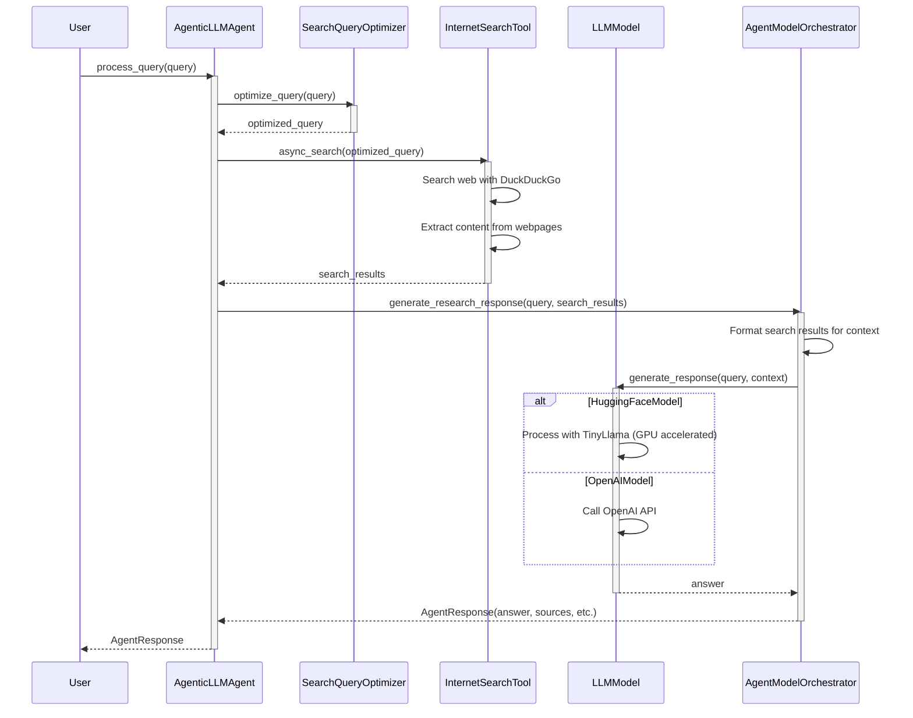
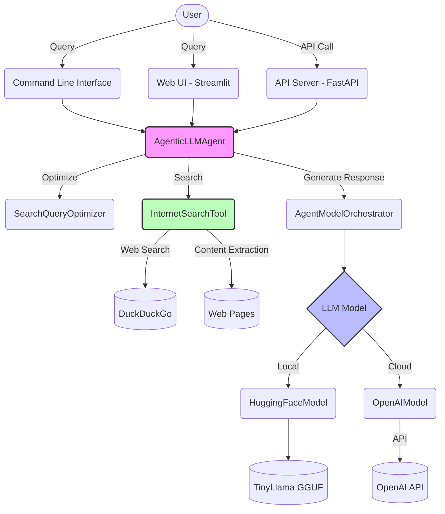
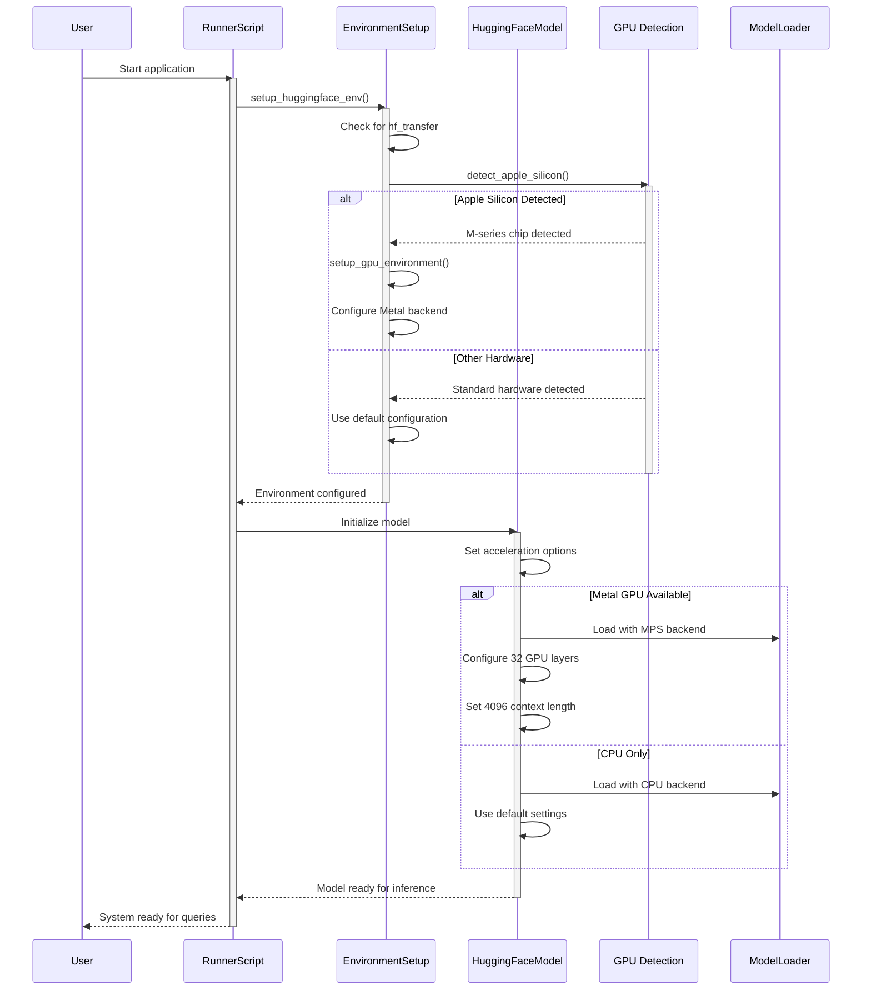

# Agentic LLM Web Search

An intelligent agent that combines local LLM inference with web search capabilities to provide well-researched answers with proper citations. Optimized for python3 3.12 with TinyLlama and GPU acceleration on Apple Silicon M-series chips.

## Quick Start

1. Clone the repository and create a virtual environment:
```bash
# Clone the repository
git clone https://github.com/yourusername/agentic-llm-search.git
cd agentic-llm-search

# Create and activate a virtual environment
python3 -m venv venv
source venv/bin/activate

# Install dependencies
pip3 install -r requirements.txt
```

2. Install ctransformers with Metal support (for Apple Silicon Macs):
```bash
# Uninstall any existing ctransformers installation
pip3 uninstall ctransformers --yes

# Reinstall with Metal support
CT_METAL=1 pip3 install ctransformers --no-binary ctransformers
```

3. Download the model and run the application:
```bash
# Download the TinyLlama model
python3 download_model.py

# Run the application
python3 main.py
```

## Features

- **Internet Search**: Fetch and process information from the web using DuckDuckGo search
- **Shodan Integration**: Search for internet-connected devices and services using Shodan
- **Local LLM Inference**: Use TinyLlama for efficient inference on your local machine
- **GPU Acceleration**: Support for Apple Silicon M-series GPU acceleration using Metal
- **OpenAI Integration**: Optionally use OpenAI models for more powerful responses
- **Citation Support**: Responses include proper citations to search results
- **python3 3.12 Optimized**: Built to leverage the latest python3 features
- **Content Analysis**: Extract and process content from multiple web sources
- **Multiple Interfaces**: CLI, Web UI, and API options

## Documentation

- [Main README](README.md): Overview and general usage
- [Shodan Integration](SHODAN_INTEGRATION.md): Using the Shodan search capabilities
- [Multi-Model Support](MULTI_MODEL_SUPPORT.md): Working with different LLM models
- [Implementation Details](IMPLEMENTATION_SUMMARY.md): Technical details on the implementation
- [Improvements](IMPROVEMENTS.md): Planned future improvements

## Installation

1. Clone the repository
```bash
git clone https://github.com/yourusername/agentic-llm-search.git
cd agentic-llm-search
```

2. Set up a python3 virtual environment:

```bash
python3 -m venv venv
source venv/bin/activate  # On Windows: venv\Scripts\activate
```

3. Install dependencies:

```bash
pip3 install -r requirements.txt
```

4. Download the TinyLlama model:

```bash
python3 download_model.py
```

5. Run the setup script to verify environment and install missing dependencies:

```bash
python3 setup.py
```

6. Check compatibility with python3 3.12:

```bash
python3 check_compatibility.py
```

7. Verify GPU acceleration support:

```bash
python3 check_gpu.py
```

## GPU Acceleration

This project supports hardware acceleration for faster model inference:

### Apple Silicon (M1/M2/M3)

On Apple Silicon Macs, the system uses Metal Performance Shaders (MPS) to accelerate model inference:

- Automatically detects M-series chips and configures GPU acceleration
- Uses up to 32 GPU-accelerated layers with ctransformers
- Provides approximately 2-5x speedup compared to CPU-only inference
- Extended context length (4096 tokens) to avoid token limit warnings

### Installing ctransformers with Metal Support

For optimal performance on macOS with Apple Silicon, install ctransformers with Metal support:

```bash
# Uninstall any existing ctransformers installation
pip3 uninstall ctransformers --yes

# Reinstall with Metal support
CT_METAL=1 pip3 install ctransformers --no-binary ctransformers
```

This enables GPU acceleration for inference using the Metal framework on Apple Silicon Macs.

### Configuration

You can adjust GPU settings in your `.env` file:

```
USE_GPU=True          # Set to False to force CPU only
USE_METAL=True        # For Apple Silicon GPUs 
CONTEXT_LENGTH=4096   # Increased token context length
GPU_LAYERS=32         # Number of layers to offload to GPU
```

### Performance Benchmarking

To test the performance of the LLM model on your system and compare CPU vs GPU speeds:

```bash
python3 benchmark.py

# Customize the benchmark
python3 benchmark.py --model ./src/models/tinyllama-1.1b-chat-v1.0.Q4_K_M.gguf --runs 5 --context-length 4096
```

The benchmark tool measures:
- Token generation speed
- Inference time
- Speedup factor with GPU acceleration
- System and hardware configuration

## Usage

### Testing the Agent

Run the interactive test script:

```bash
python3 test_agentic_search.py
```

Enter your questions when prompted, and the agent will:
1. Search the web for relevant information
2. Process the search results
3. Generate a comprehensive answer with citations

### Model Configuration

The agent supports two model providers:

#### 1. HuggingFace (Local Models)

To use HuggingFace models (recommended for privacy and no API costs):

```python3
# In your code
agent = AgenticLLMAgent(
    model_name="./src/models/tinyllama-1.1b-chat-v1.0.Q4_K_M.gguf",
    model_provider="huggingface"
)

# Or in .env file
DEFAULT_MODEL=./src/models/tinyllama-1.1b-chat-v1.0.Q4_K_M.gguf
MODEL_PROVIDER=huggingface
```

Available HuggingFace models:
- `./src/models/tinyllama-1.1b-chat-v1.0.Q4_K_M.gguf` (recommended for low resource usage)
- `TheBloke/Llama-2-7B-Chat-GGUF` (better quality but requires more RAM)
- `microsoft/phi-2` (good balance of size and quality)

### 2. OpenAI Models

To use OpenAI's models (requires API key):

```
# .env file
DEFAULT_MODEL=gpt-3.5-turbo
MODEL_PROVIDER=openai
OPENAI_API_KEY=your_api_key_here
```

Available OpenAI models:
- `gpt-3.5-turbo` (fast and cost-effective)
- `gpt-4` (higher quality but more expensive)
- `gpt-4-turbo` (latest version)

### 3. Azure OpenAI Models

To use Azure OpenAI Services (requires Azure OpenAI resource):

```
# .env file
DEFAULT_MODEL=gpt-35-turbo  # Should match your Azure OpenAI deployment name
MODEL_PROVIDER=azure-openai
AZURE_OPENAI_API_KEY=your_azure_openai_api_key
AZURE_OPENAI_ENDPOINT=https://your-resource-name.openai.azure.com/
AZURE_OPENAI_API_VERSION=2023-05-15
```

Available Azure OpenAI models (deployment names may vary):
- `gpt-35-turbo` (Azure's GPT-3.5)
- `gpt-4` (Azure's GPT-4)
- `gpt-4-turbo` (Azure's GPT-4 Turbo)

## Usage

### Using run.sh Script (Recommended)

The easiest way to use the application is with the included `run.sh` script, which handles environment setup, model checking, and provides a simple interface:

```bash
# Make the script executable if needed
chmod +x run.sh

# Run the application
./run.sh
```

The script will:
1. Check for Python 3.12+ and set up a virtual environment
2. Verify the model is downloaded or download it if missing
3. Let you choose a model provider (Local TinyLlama or Azure OpenAI)
4. Let you select between CLI and Web Interface

### Command Line Interface

Run the agent in interactive mode:
```bash
python3 main.py
```

Or ask a single question:
```bash
python3 main.py "What are the latest developments in AI?"
```

Additional CLI options:
```
--model MODEL         LLM model to use (default: ./src/models/tinyllama-1.1b-chat-v1.0.Q4_K_M.gguf)
--provider PROVIDER   Model provider to use (choices: huggingface, openai, azure-openai)
--no-search           Disable internet search
--max-results MAX     Maximum search results to use (default: 5)
```

### Web Interface

Run the Streamlit web app:
```bash
streamlit run app.py
```

Then open your browser at http://localhost:8501.

### API Server

Start the FastAPI server:
```bash
python3 -m uvicorn api:app --reload
```

Then access the API at http://localhost:8000 or view the API documentation at http://localhost:8000/docs.

## Development

### Project Structure

```
├── app.py              # Streamlit web interface
├── api.py              # FastAPI web API
├── main.py             # Command-line interface
├── requirements.txt    # Dependencies
├── src/
│   ├── __init__.py     # Core data models
│   ├── agents/         # Agent implementation
│   ├── models/         # LLM model wrappers
│   ├── tools/          # Search and utility tools
│   └── utils/          # Utility functions
└── tests/              # Test cases
```

### Running Tests

```bash
pytest tests/
```

## System Architecture

### Sequence Diagram

The following sequence diagram illustrates how the different components of the Agentic LLM Search system interact during a typical query:



### Component Diagram



## Deployment Sequence Diagram

This diagram shows how the system handles model initialization and setup, especially with GPU acceleration:



## License

MIT

## Troubleshooting

### Diagnostic Tools

The project includes a comprehensive suite of diagnostic tools to help you identify and fix issues:

#### System Diagnostics

Run the main diagnostics tool to check your entire system configuration:

```bash
python3 diagnostics.py
```

This tool checks:
- System information and hardware compatibility
- GPU configuration and Metal support for Apple Silicon
- Environment variables and configuration
- Model files and their status
- Module structure and implementation
- Quick functionality test

It provides personalized recommendations based on your specific setup.

#### Log Analysis

Use the log analyzer to diagnose issues from log files:

```bash
# Analyze the most recent log file
python3 analyze_logs.py

# Analyze a specific log file
python3 analyze_logs.py --log path/to/logfile.log

# Analyze all log files in a directory
python3 analyze_logs.py --dir logs --all
```

The log analyzer automatically identifies common error patterns and provides targeted solutions.

#### GPU Acceleration Check

To specifically check GPU acceleration support:

```bash
python3 check_gpu.py
```

#### HuggingFace Transfer Issues

If you encounter issues with model downloads:

```bash
# Run the hf_transfer diagnostics tool
python3 install_hf_transfer.py --diagnose

# Force reinstall hf_transfer
pip3 uninstall -y hf_transfer
pip3 install hf_transfer==0.1.4
```

### Common Issues

#### GPU Acceleration Not Working

If GPU acceleration is not working as expected:

```bash
# Force specific configuration in .env
USE_GPU=True
USE_METAL=True  # For Apple Silicon
GPU_LAYERS=32   # Adjust based on your GPU capability
```

#### Context Length Warnings

If you see context length warnings in model output:

```
# Add to your .env file
CONTEXT_LENGTH=4096
```

#### Memory Issues

If the model is crashing due to memory constraints:

1. Try a smaller model variant
2. Reduce `GPU_LAYERS` setting in `.env`
3. Set `USE_GPU=False` to use CPU only mode
4. Adjust batch size with `BATCH_SIZE=1` in `.env`

## Credits

Built with python3, OpenAI, HuggingFace, DuckDuckGo Search, FastAPI, and Streamlit.
