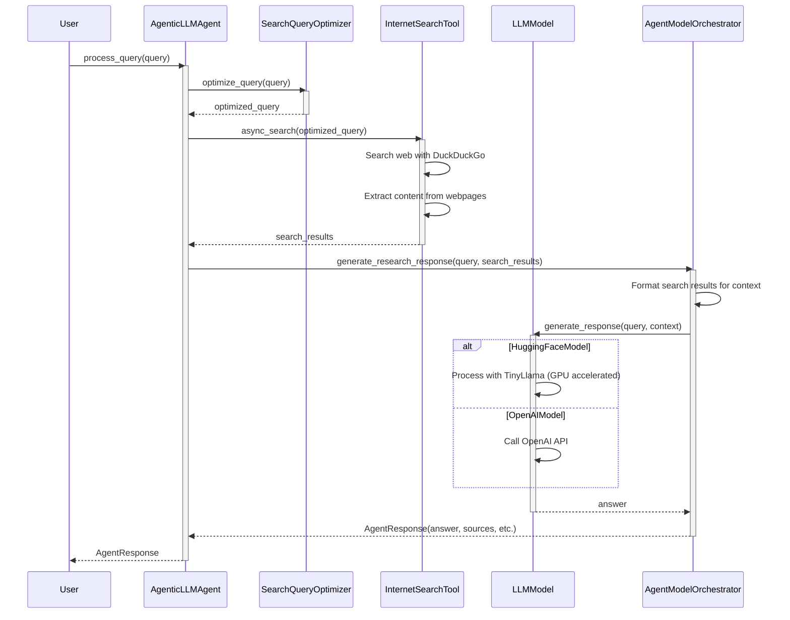
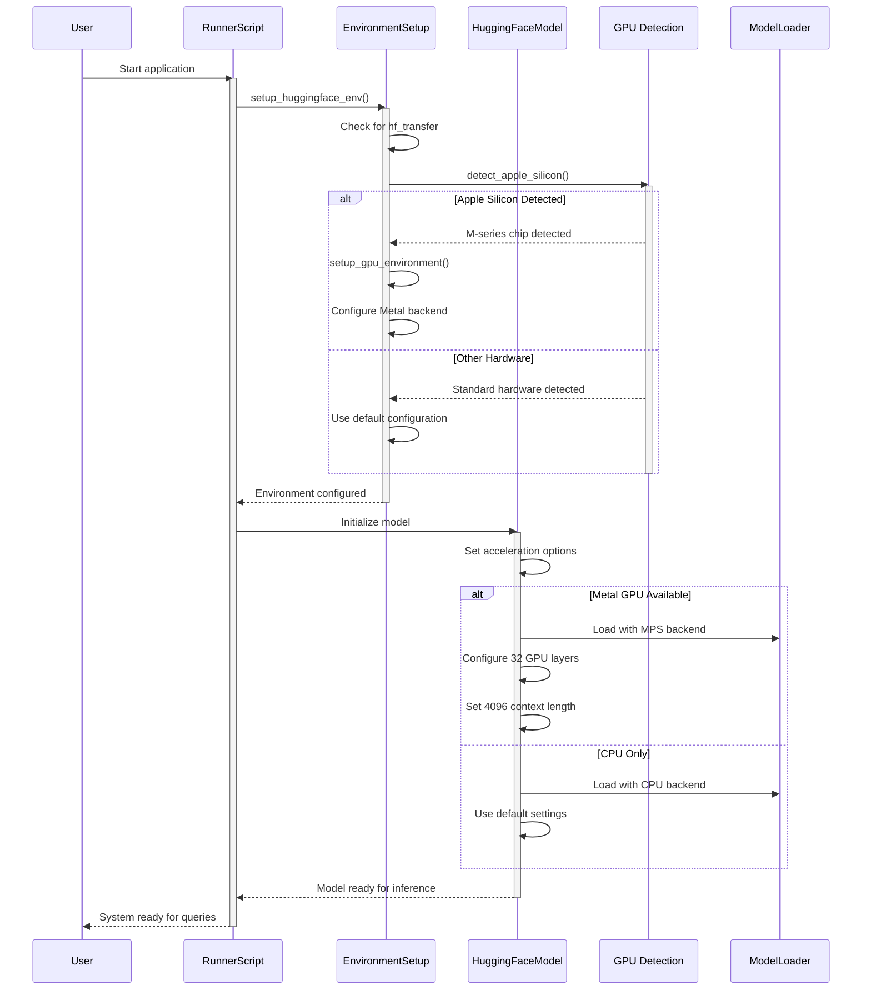

# Agentic LLM Web Search

An intelligent agent that combines local LLM inference with web search capabilities to provide well-researched answers with proper citations. Optimized for Python 3.12 with TinyLlama and GPU acceleration on Apple Silicon M-series chips.

## Features

- **Internet Search**: Fetch and process information from the web using DuckDuckGo search
- **Local LLM Inference**: Use TinyLlama for efficient inference on your local machine
- **GPU Acceleration**: Support for Apple Silicon M-series GPU acceleration using Metal
- **OpenAI Integration**: Optionally use OpenAI models for more powerful responses
- **Citation Support**: Responses include proper citations to search results
- **Python 3.12 Optimized**: Built to leverage the latest Python features
- **Content Analysis**: Extract and process content from multiple web sources
- **Multiple Interfaces**: CLI, Web UI, and API options

## Installation

1. Clone the repository
```bash
git clone https://github.com/yourusername/agentic-llm-search.git
cd agentic-llm-search
```

2. Set up a Python virtual environment:

```bash
python3 -m venv venv
source venv/bin/activate  # On Windows: venv\Scripts\activate
```

3. Install dependencies:

```bash
pip install -r requirements.txt
```

4. Download the TinyLlama model:

```bash
python download_model.py
```

5. Check compatibility with Python 3.12:

```bash
python check_compatibility.py
```

6. Verify GPU acceleration support:

```bash
python check_gpu.py
```

## GPU Acceleration

This project supports hardware acceleration for faster model inference:

### Apple Silicon (M1/M2/M3)

On Apple Silicon Macs, the system uses Metal Performance Shaders (MPS) to accelerate model inference:

- Automatically detects M-series chips and configures GPU acceleration
- Uses up to 32 GPU-accelerated layers with ctransformers
- Provides approximately 2-5x speedup compared to CPU-only inference
- Extended context length (4096 tokens) to avoid token limit warnings

### Configuration

You can adjust GPU settings in your `.env` file:

```
USE_GPU=True          # Set to False to force CPU only
USE_METAL=True        # For Apple Silicon GPUs 
CONTEXT_LENGTH=4096   # Increased token context length
```

## Usage

### Testing the Agent

Run the interactive test script:

```bash
python test_agentic_search.py
```

Enter your questions when prompted, and the agent will:
1. Search the web for relevant information
2. Process the search results
3. Generate a comprehensive answer with citations

### Model Configuration

The agent supports two model providers:

#### 1. HuggingFace (Local Models)

To use HuggingFace models (recommended for privacy and no API costs):

```python
# In your code
agent = AgenticLLMAgent(
    model_name="./src/models/tinyllama-1.1b-chat-v1.0.Q4_K_M.gguf",
    model_provider="huggingface"
)

# Or in .env file
DEFAULT_MODEL=./src/models/tinyllama-1.1b-chat-v1.0.Q4_K_M.gguf
MODEL_PROVIDER=huggingface
```

Available HuggingFace models:
- `./src/models/tinyllama-1.1b-chat-v1.0.Q4_K_M.gguf` (recommended for low resource usage)
- `TheBloke/Llama-2-7B-Chat-GGUF` (better quality but requires more RAM)
- `microsoft/phi-2` (good balance of size and quality)

### 2. OpenAI Models

To use OpenAI's models (requires API key):

```
# .env file
DEFAULT_MODEL=gpt-3.5-turbo
MODEL_PROVIDER=openai
OPENAI_API_KEY=your_api_key_here
```

Available OpenAI models:
- `gpt-3.5-turbo` (fast and cost-effective)
- `gpt-4` (higher quality but more expensive)
- `gpt-4-turbo` (latest version)

## Usage

### Command Line Interface

Run the agent in interactive mode:
```bash
python main.py
```

Or ask a single question:
```bash
python main.py "What are the latest developments in AI?"
```

Additional CLI options:
```
--model MODEL         LLM model to use (default: ./src/models/tinyllama-1.1b-chat-v1.0.Q4_K_M.gguf)
--provider PROVIDER   Model provider to use (choices: huggingface, openai)
--no-search           Disable internet search
--max-results MAX     Maximum search results to use (default: 5)
```

### Web Interface

Run the Streamlit web app:
```bash
streamlit run app.py
```

Then open your browser at http://localhost:8501.

### API Server

Start the FastAPI server:
```bash
python -m uvicorn api:app --reload
```

Then access the API at http://localhost:8000 or view the API documentation at http://localhost:8000/docs.

## Development

### Project Structure

```
├── app.py              # Streamlit web interface
├── api.py              # FastAPI web API
├── main.py             # Command-line interface
├── requirements.txt    # Dependencies
├── src/
│   ├── __init__.py     # Core data models
│   ├── agents/         # Agent implementation
│   ├── models/         # LLM model wrappers
│   ├── tools/          # Search and utility tools
│   └── utils/          # Utility functions
└── tests/              # Test cases
```

### Running Tests

```bash
pytest tests/
```

## System Architecture

### Sequence Diagram

The following sequence diagram illustrates how the different components of the Agentic LLM Search system interact during a typical query:



### Component Diagram


## Deployment Sequence Diagram

This diagram shows how the system handles model initialization and setup, especially with GPU acceleration:



## License

MIT

## Troubleshooting

### Common Issues

#### Model Download Issues

If you encounter issues with model downloads:

```bash
# Run the hf_transfer diagnostics tool
python install_hf_transfer.py --diagnose

# Force reinstall hf_transfer
pip uninstall -y hf_transfer
pip install hf_transfer==0.1.4
```

#### GPU Acceleration Not Working

If GPU acceleration is not working as expected:

```bash
# Check GPU status
python check_gpu.py

# Force specific configuration in .env
USE_GPU=True
USE_METAL=True  # For Apple Silicon
GPU_LAYERS=32   # Adjust based on your GPU capability
```

#### Context Length Warnings

If you see context length warnings in model output:

```
# Add to your .env file
CONTEXT_LENGTH=4096
```

#### Memory Issues

If the model is crashing due to memory constraints:

1. Try a smaller model variant
2. Reduce `GPU_LAYERS` setting in `.env`
3. Set `USE_GPU=False` to use CPU only mode
4. Adjust batch size with `BATCH_SIZE=1` in `.env`

### Diagnostic Tools

The project includes several diagnostic tools:

- `check_gpu.py`: Verifies GPU acceleration support
- `install_hf_transfer.py`: Handles HuggingFace dependency issues
- `src/models/env_setup.py`: Contains environment setup utilities

## Credits

Built with Python, OpenAI, HuggingFace, DuckDuckGo Search, FastAPI, and Streamlit.
