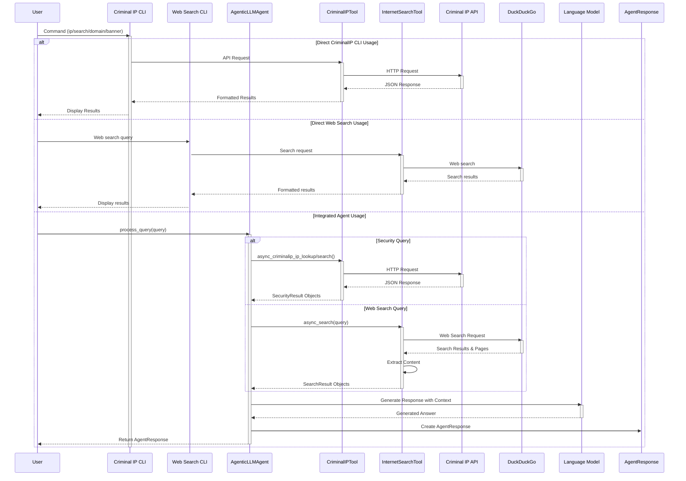

# Agentic LLM Web Search

An intelligent agent that combines local LLM inference with web search capabilities to provide well-researched answers with proper citations. Optimized for python3 3.12 with TinyLlama and GPU acceleration on Apple Silicon M-series chips.

## Quick Start

1. Clone the repository and create a virtual environment:
```bash
# Clone the repository
git clone https://github.com/yourusername/agentic-llm-search.git
cd agentic-llm-search

# Create and activate a virtual environment
python3 -m venv venv
source venv/bin/activate

# Install dependencies
pip3 install -r requirements.txt
```

2. Install ctransformers with Metal support (for Apple Silicon Macs):
```bash
# Uninstall any existing ctransformers installation
pip3 uninstall ctransformers --yes

# Reinstall with Metal support
CT_METAL=1 pip3 install ctransformers --no-binary ctransformers
```

3. Download the model and run the application:
```bash
# Download the TinyLlama model
python3 download_model.py

# Run the application
python3 main.py
```

## Features

- **Internet Search**: Fetch and process information from the web using DuckDuckGo search
- **Threat Intelligence**: Integrate with cybersecurity search engines for security research
  - **Criminal IP**: Analyze IP reputation, security scores, and identify malicious activities
  - **Shodan Integration**: Search for internet-connected devices and services using Shodan
  - **FOFA Integration**: Search for internet-connected devices and services using FOFA
- **Local LLM Inference**: Use TinyLlama for efficient inference on your local machine
- **GPU Acceleration**: Support for Apple Silicon M-series GPU acceleration using Metal
- **OpenAI Integration**: Optionally use OpenAI models for more powerful responses
- **Citation Support**: Responses include proper citations to search results
- **python3 3.12 Optimized**: Built to leverage the latest python3 features
- **Content Analysis**: Extract and process content from multiple web sources
- **Multiple Interfaces**: CLI, Web UI, and API options

## Documentation

- [Main README](README.md): Overview and general usage
- [Criminal IP Integration](CRIMINALIP_INTEGRATION.md): Using the Criminal IP cybersecurity search capabilities
- [Shodan Integration](SHODAN_INTEGRATION.md): Using the Shodan search capabilities
- [FOFA Integration](FOFA_INTEGRATION.md): Using the Fofa search capabilities
- [Search Tools Comparison](SEARCH_TOOLS_COMPARISON.md): Comparison between different search tools
- [Multi-Model Support](MULTI_MODEL_SUPPORT.md): Working with different LLM models
- [Implementation Details](IMPLEMENTATION_SUMMARY.md): Technical details on the implementation
- [Improvements](IMPROVEMENTS.md): Planned future improvements

## Installation

1. Clone the repository
```bash
git clone https://github.com/yourusername/agentic-llm-search.git
cd agentic-llm-search
```

2. Set up a python3 virtual environment:

```bash
python3 -m venv venv
source venv/bin/activate  # On Windows: venv\Scripts\activate
```

3. Install dependencies:

```bash
pip3 install -r requirements.txt
```

4. Download the TinyLlama model:

```bash
python3 download_model.py
```

5. Run the setup script to verify environment and install missing dependencies:

```bash
python3 setup.py
```

6. Check compatibility with python3 3.12:

```bash
python3 check_compatibility.py
```

7. Verify GPU acceleration support:

```bash
python3 check_gpu.py
```

## GPU Acceleration

This project supports hardware acceleration for faster model inference:

### Apple Silicon (M1/M2/M3)

On Apple Silicon Macs, the system uses Metal Performance Shaders (MPS) to accelerate model inference:

- Automatically detects M-series chips and configures GPU acceleration
- Uses up to 32 GPU-accelerated layers with ctransformers
- Provides approximately 2-5x speedup compared to CPU-only inference
- Extended context length (4096 tokens) to avoid token limit warnings

### Installing ctransformers with Metal Support

For optimal performance on macOS with Apple Silicon, install ctransformers with Metal support:

```bash
# Uninstall any existing ctransformers installation
pip3 uninstall ctransformers --yes

# Reinstall with Metal support
CT_METAL=1 pip3 install ctransformers --no-binary ctransformers
```

This enables GPU acceleration for inference using the Metal framework on Apple Silicon Macs.

### Configuration

You can adjust GPU settings in your `.env` file:

```
USE_GPU=True          # Set to False to force CPU only
USE_METAL=True        # For Apple Silicon GPUs 
CONTEXT_LENGTH=4096   # Increased token context length
GPU_LAYERS=32         # Number of layers to offload to GPU
```

### Performance Benchmarking

To test the performance of the LLM model on your system and compare CPU vs GPU speeds:

```bash
python3 benchmark.py

# Customize the benchmark
python3 benchmark.py --model ./src/models/tinyllama-1.1b-chat-v1.0.Q4_K_M.gguf --runs 5 --context-length 4096
```

The benchmark tool measures:
- Token generation speed
- Inference time
- Speedup factor with GPU acceleration
- System and hardware configuration

## Usage

### Testing the Agent

Run the interactive test script:

```bash
python3 test_agentic_search.py
```

Enter your questions when prompted, and the agent will:
1. Search the web for relevant information
2. Process the search results
3. Generate a comprehensive answer with citations

### Model Configuration

The agent supports two model providers:

#### 1. HuggingFace (Local Models)

To use HuggingFace models (recommended for privacy and no API costs):

```python3
# In your code
agent = AgenticLLMAgent(
    model_name="./src/models/tinyllama-1.1b-chat-v1.0.Q4_K_M.gguf",
    model_provider="huggingface"
)

# Or in .env file
DEFAULT_MODEL=./src/models/tinyllama-1.1b-chat-v1.0.Q4_K_M.gguf
MODEL_PROVIDER=huggingface
```

Available HuggingFace models:
- `./src/models/tinyllama-1.1b-chat-v1.0.Q4_K_M.gguf` (recommended for low resource usage)
- `TheBloke/Llama-2-7B-Chat-GGUF` (better quality but requires more RAM)
- `microsoft/phi-2` (good balance of size and quality)

### 2. OpenAI Models

To use OpenAI's models (requires API key):

```
# .env file
DEFAULT_MODEL=gpt-3.5-turbo
MODEL_PROVIDER=openai
OPENAI_API_KEY=your_api_key_here
```

Available OpenAI models:
- `gpt-3.5-turbo` (fast and cost-effective)
- `gpt-4` (higher quality but more expensive)
- `gpt-4-turbo` (latest version)

### 3. Azure OpenAI Models

To use Azure OpenAI Services (requires Azure OpenAI resource):

```
# .env file
DEFAULT_MODEL=gpt-35-turbo  # Should match your Azure OpenAI deployment name
MODEL_PROVIDER=azure-openai
AZURE_OPENAI_API_KEY=your_azure_openai_api_key
AZURE_OPENAI_ENDPOINT=https://your-resource-name.openai.azure.com/
AZURE_OPENAI_API_VERSION=2023-05-15
```

Available Azure OpenAI models (deployment names may vary):
- `gpt-35-turbo` (Azure's GPT-3.5)
- `gpt-4` (Azure's GPT-4)
- `gpt-4-turbo` (Azure's GPT-4 Turbo)

## Using Criminal IP Search

The Criminal IP integration provides advanced cybersecurity search capabilities alongside Shodan and FOFA. This feature offers IP reputation, threat intelligence, and security scoring for enhanced cyber threat intelligence.

### Setting up Criminal IP

1. Create a Criminal IP account at [Criminal IP](https://www.criminalip.io/developer)
2. Generate an API key in your account dashboard
3. Configure your API key using one of these methods:

   **Option 1: Using the CLI setup command (Recommended)**
   ```bash
   # Set up with interactive prompt (secure)
   ./criminalip_cli.py setup

   # Or provide the key directly
   ./criminalip_cli.py setup --api-key YOUR_API_KEY
   ```

   **Option 2: Manual setup**
   Add to your `.env` file:
   ```
   CRIMINAL_IP_API_KEY=your_criminalip_api_key_here
   ```

### Criminal IP CLI

Use the dedicated CriminalIP CLI for powerful cybersecurity searches:

```bash
# Get information about an IP address
./criminalip_cli.py ip 8.8.8.8

# Search for assets matching a query
./criminalip_cli.py search "apache 2.4"

# Get information about a domain
./criminalip_cli.py domain example.com

# Search for banner information
./criminalip_cli.py banner "nginx"

# View API account information and usage
./criminalip_cli.py info

# Get help with available commands
./criminalip_cli.py help

# Validate your API key
./criminalip_cli.py setup --validate
```

You can also access the Criminal IP CLI through the main run.sh script:
```bash
./run.sh
# Select option 3 for "Criminal IP CLI"
```

### Programmatic Usage

You can integrate Criminal IP capabilities into your Python applications:

```python
from src.agents.agentic_llm_with_criminalip import AgenticLLM

# Initialize the agent with Criminal IP capabilities
agent = AgenticLLM()

# Synchronous usage
response = agent.process_criminalip_search("apache 2.4")
response = agent.process_criminalip_ip("8.8.8.8")

# Asynchronous usage
response = await agent.process_criminalip_query("apache 2.4")
response = await agent.process_criminalip_host("8.8.8.8")

# Access formatted answer
print(response.answer)

# Access sources
for source in response.sources:
    print(f"- {source.title}: {source.url}")
```

### Direct API Access

For advanced use cases, you can access the Criminal IP API directly:

```python
from src.tools.criminalip_tool import CriminalIPTool
import os

# Initialize the tool with your API key
api_key = os.getenv("CRIMINAL_IP_API_KEY")
criminalip = CriminalIPTool(api_key)

# Available methods
ip_report = criminalip.search_ip("8.8.8.8")
ip_malicious = criminalip.check_ip_malicious("8.8.8.8")
domain_info = criminalip.search_domain("example.com")
assets = criminalip.asset_search("apache 2.4")
banners = criminalip.banner_search("nginx")
user_info = criminalip.get_user_info()
```

### Example Use Cases

- **Security Research**: Investigate IP addresses for malicious activity and security vulnerabilities
- **Threat Intelligence**: Research domains and identify potential security issues and threats
- **Asset Discovery**: Find internet-exposed services and assess organization risk posture
- **Vulnerability Assessment**: Identify potentially vulnerable systems through version and banner analysis
- **Network Security Monitoring**: Track changes in your exposed services and identify new risks

For detailed information, see the [Criminal IP Integration](CRIMINALIP_INTEGRATION.md) documentation and [API Format](CRIMINALIP_API_FORMAT.md) reference.

### Criminal IP Integration Sequence Diagram

The following sequence diagram illustrates how Criminal IP is integrated with the agentic-llm-search project:



### Integrated Search Component Architecture


### Integrated System Deployment Architecture

The following deployment diagram illustrates how both web search and Criminal IP components are deployed together:


This integrated architecture shows how the system combines both web search capabilities (via DuckDuckGo) and security search capabilities (via Criminal IP) into a unified framework. The modular design allows each component to function either independently (via dedicated CLIs) or as integrated parts of the complete system. This approach makes the system highly extensible, allowing for easy maintenance and addition of new search capabilities without affecting other parts of the system.
