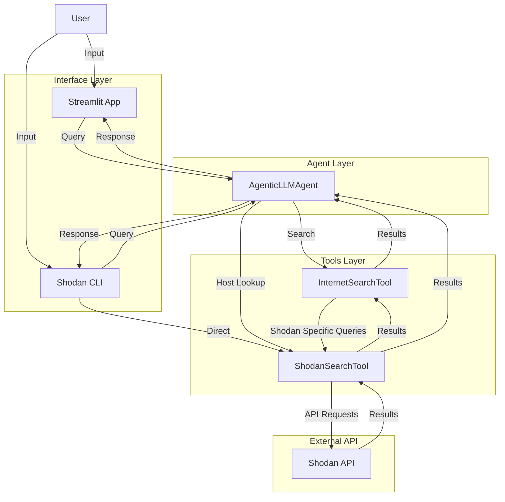
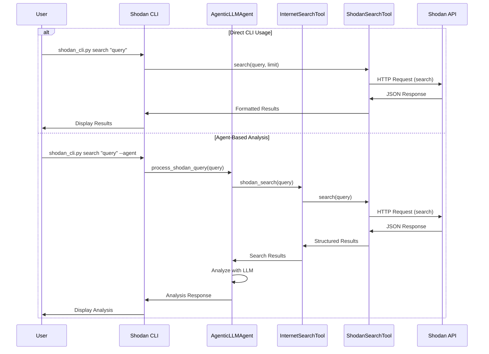
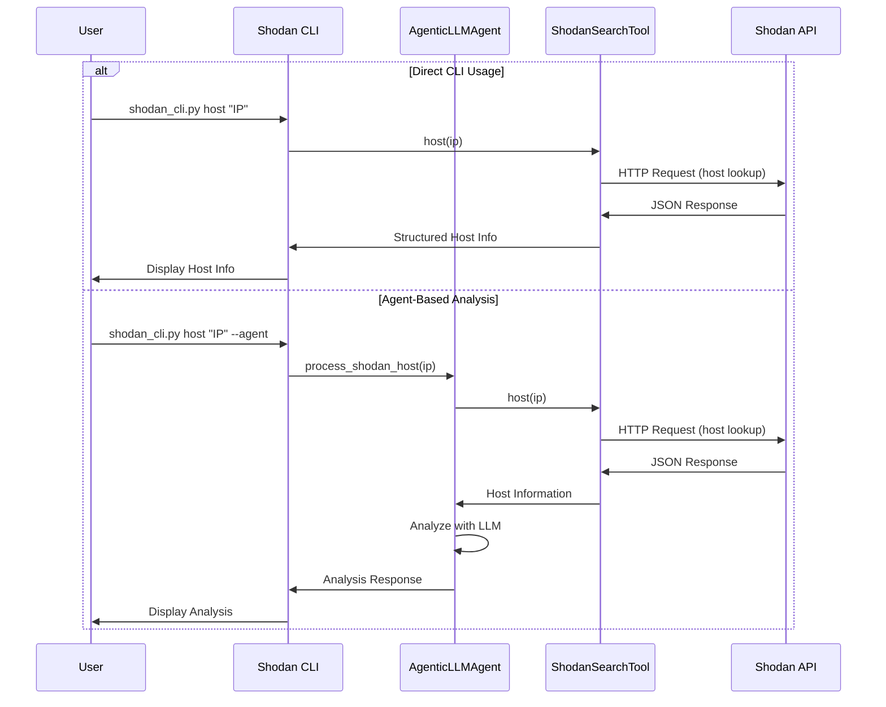
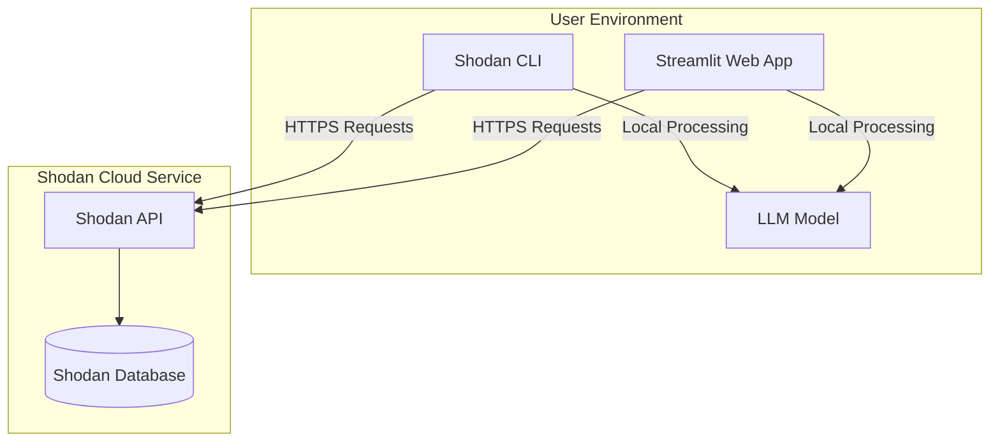

# Shodan Integration

This document explains how to use the Shodan integration features in the Agentic LLM Search application.

## Overview

[Shodan](https://www.shodan.io/) is a search engine that lets users search for Internet-connected devices and services. Our integration allows you to:

1. Search for devices and services using Shodan's search syntax
2. Get detailed information about specific IP addresses
3. Use the LLM agent to analyze and explain Shodan results

## Setup

1. **Get a Shodan API Key**: Sign up at [Shodan.io](https://account.shodan.io/register) to get an API key.

2. **Add Your API Key**: Update your `.env` file to include your Shodan API key:
   ```
   SHODAN_API_KEY=your_shodan_api_key_here
   ```

## Using the Command Line Interface

The application includes a dedicated command-line interface for Shodan searches:

```bash
# Search for devices
python shodan_cli.py search "apache country:US" --limit 10

# Get detailed information about an IP
python shodan_cli.py host 8.8.8.8

# Count devices matching a query
python shodan_cli.py count "port:22" --facets country:20 org:10

# Get API plan information
python shodan_cli.py info
```

### Advanced Usage

Use the `--agent` flag to have the LLM analyze the results:

```bash
# Use the LLM agent to analyze search results
python shodan_cli.py search "apache country:US" --agent

# Use the LLM agent to analyze host information
python shodan_cli.py host 8.8.8.8 --agent
```

Use the `--raw` flag to get JSON output:

```bash
# Get raw JSON output
python shodan_cli.py search "apache country:US" --raw
```

## Using the Web Interface

1. Start the Streamlit web interface:
   ```bash
   streamlit run app.py
   ```

2. In the sidebar, ensure "Enable Shodan Search" is checked.

3. Change the "Search Type" to "Shodan" and select either "Query" or "Host Lookup".

4. Enter your search query or IP address and click "Ask".

### Example Shodan Queries

- Basic search: `apache`
- Search by country: `apache country:US`
- Search by port: `port:22 openssh`
- Search by product: `product:nginx`
- Complex search: `apache country:US port:443 org:"Amazon"`

## Programmatic Usage

You can use the Shodan integration in your Python code:

```python
from src.agents.agentic_llm import AgenticLLMAgent

# Initialize the agent
agent = AgenticLLMAgent()

# Search for devices
response = agent.process_shodan_query_sync("apache country:US", limit=5)

# Look up host information
host_response = agent.process_shodan_host_sync("8.8.8.8")

# Access results
for source in response.sources:
    print(f"{source.title}: {source.url}")
    print(source.content[:100] + "...")
```

## Security Considerations

- Shodan is a powerful tool that reveals information about internet-facing devices
- Use responsibly and ethically
- Do not use this tool to access systems without permission
- Always respect privacy and legal restrictions

## Architecture Diagrams

### Component Diagram



### Sequence Diagram: Search Process



### Sequence Diagram: Host Lookup Process



### Deployment Diagram


